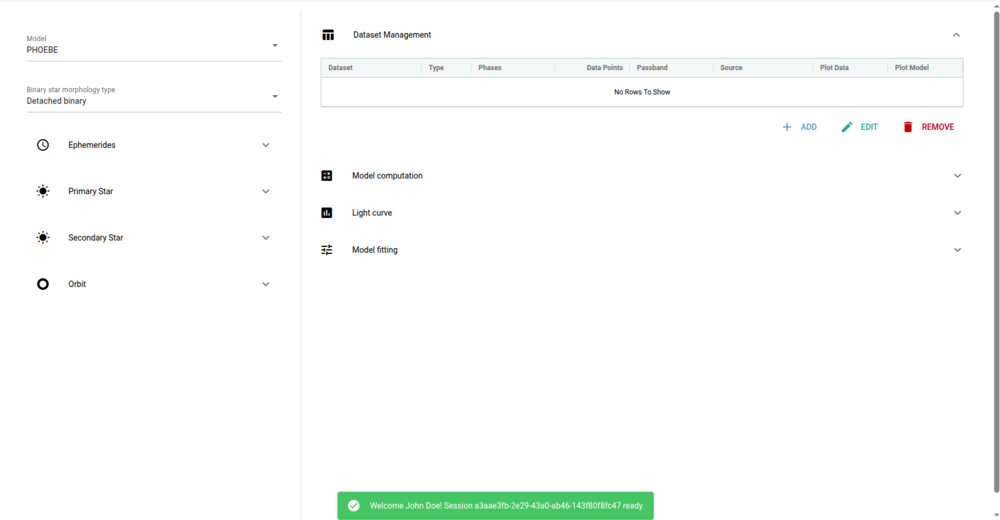
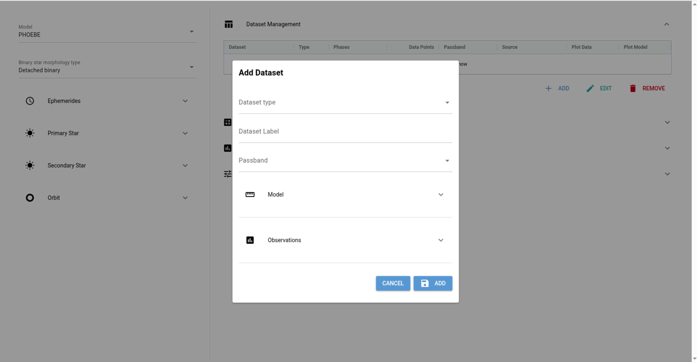
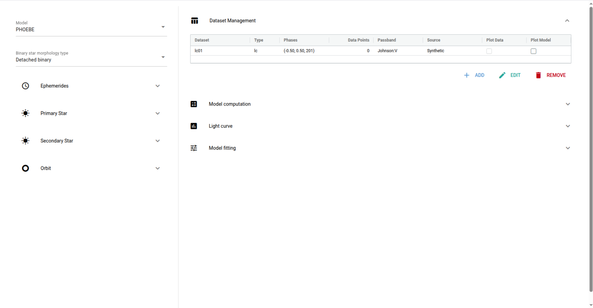
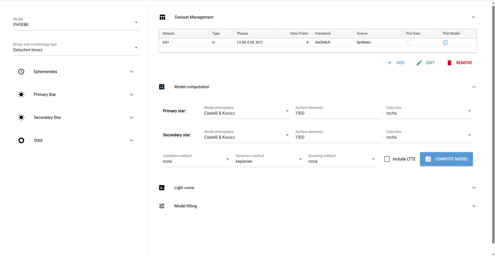
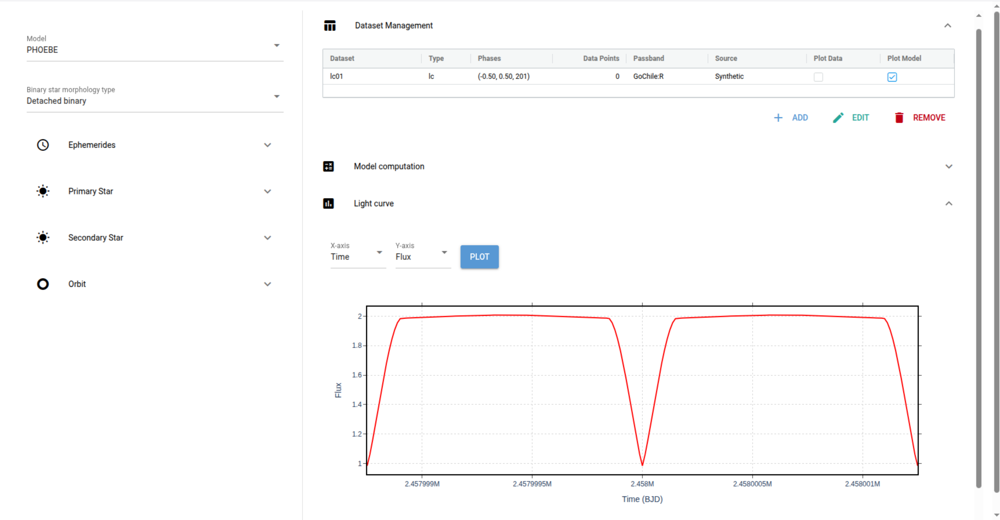
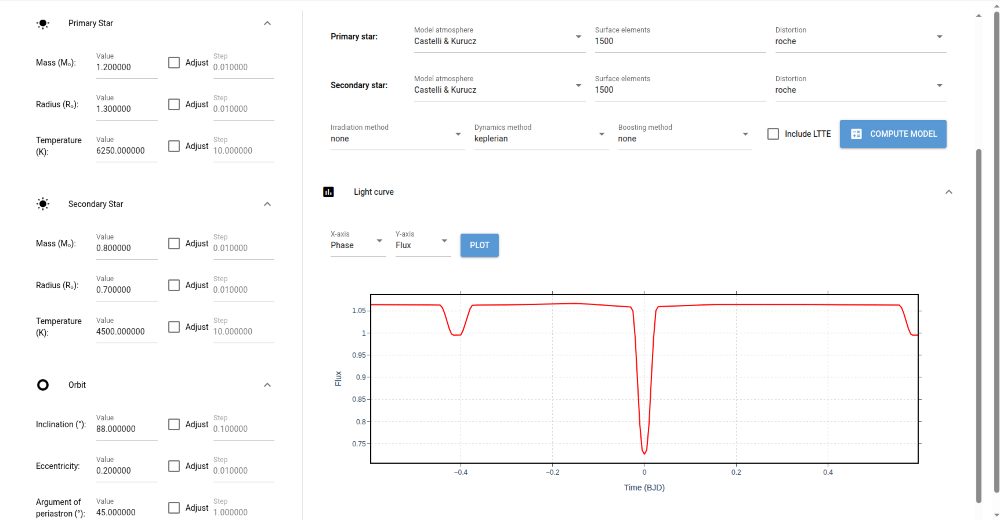

PHOEBE lab UI
=============

PHOEBE lab UI serves as a front-end to a simplified [PHOEBE](https://phoebe-project.org) model designed to be deployed in undergraduate or graduate student labs. It is built with modern, web-based toolkits that enable you to run in online and access it from anywhere.

Example usage
-------------

When you load the PHOEBE lab interface, you will be greeted by the login screen:

Session ID is a unique identifier that connects your session with the underlying PHOEBE server and it allows you to leave your browser window and reconnect at a later time. The ID you see will of course be different from the one depicted here. Your first and last name are attached to the session ID and identify you to your instructor. Enter your first and last name here and click the CONTINUE button.

Once logged in, you will be presented with the main screen:

Take a moment to familiarize yourself with the main PHOEBE window. The interface is separated into several panels. On the left you can see model selection, morphology type and parameter panel. On the right you can see the expanded Dataset management panel, and three collapsed panels: Model computation, Light curve, and Model fitting. Click on each drop-down menu and explore the interface. Try to drag the vertical separator to tune the layout to your liking. Once you feel comfortable with the interface, let us explore the model and build some intuition on how parameters impact light curves.

To begin, we will need to define a synthetic dataset. It may seem counter-intuitive why you would want to add a *dataset* if you want to compute a synthetic model, but this is indeed necessary: PHOEBE needs to know what kind of observable you would like to synthesize, covering what temporal range, in what passband, etc. To do that, click on the Add button in the Dataset Management panel. You will be presented with the following screen:

Here, Dataset type is either a light curve or a radial velocity (RV) curve; Dataset label is a unique identifier; Passband is the response curve of the filter + detector + optics for data synthesis; Model fold defines phase span for computations; and Observations is used to upload actual data.

To begin our exploration, select:

| Parameter | Value |
|-----------|-------|
| Dataset type | Light Curve |
| Dataset label | lc01 |
| Passband | Johnson:V |
| Model→Phase min | -0.50 |
| Model→Phase max | 0.50 |
| Model→Length | 201 |

This will create a synthetic dataset called 'lc01' that simulates photometric (light curve) observations in Johnson V passband that spans orbital phases between -0.50 and 0.50 in 201 synthetic points. At this time do not add any observations to the model: we will start by exploring only the synthetic model. Once you have entered these parameters and verified that no observations have been attached, click on the Add button. The dialog window will disappear and you will see a dataset entry in the dataset table:

Take a moment to read through the columns. Note that the number of data points equals 0; this column refers to the observations, so indeed there are no observed points given that we have not attached any actual data to our dataset. You should also note that you cannot select data for plotting as there are no data attached. The Plot Model checkbox, on the other hand, is responsive; please select it.

In order to compute the model, expand the Model computation panel.

There's quite a bit to process here; parameters for computing a model are set either for the primary star (first row), the secondary star (second row), or the system (third row). Let us discuss the roles of these parameters and their impact on model computation.

- Model atmosphere: this instructs PHOEBE how to compute intensities radiated from the stellar surface elements. The simplest model is 'Blackbody' which assumes only temperature dependence; two actual atmosphere models are 'Castelli & Kurucz' and 'Phoenix'; in addition to temperatures, these intensities also depend on surface gravity and metal abundances. This is all contained in PHOEBE under the hood; the only reason you would choose 'Blackbody' is when atmospheric parameters fall out of bounds for model atmospheres. For now, leave the default ('Castelli & Kurucz') for both stars.

- Surface elements: the (approximate) number of surface elements for each star. The more surface elements you choose, the more accurate the synthetic model, but at the expense of compute time. The default (1500) is a reasonable option for most cases; you would typically increase it if one object is substantially larger than the other (for example, an exoplanet transit or a symbiotic binary star).

- Distortion: this tells PHOEBE what shape it should assume for the stars. Options are 'none', 'sphere', 'rotstar', and 'roche'. 'None' should be used when the star should not be meshed and should only be considered a point mass; 'sphere' means no tidal or rotational distortion; 'rotstar' means only rotational distortion; and 'roche' means both tidal and rotational distortion. Leave the defaults ('roche') for both stars.

- Irradiation method: stars do not interact only gravitationally, they also irradiate one another. This is especially important when the temperature difference between the stars is large, for example a white dwarf-main sequence star pair. Irradiation choices include 'none', 'Wilson' and 'Horvat'. If 'none', PHOEBE will ignore irradiation effects; 'Wilson' includes heating and subsequent increase in emergent radiation; and 'Horvat' adds scattering to Wilson's model. Again, leave this at default ('none') for the time being.

- Dynamics method: this option instructs PHOEBE how to handle stellar motions. For binary systems the only option is 'Keplerian'; in higher-order multiples the other option would be 'Newtonian', accounting for non-hierarchical orbits.

- Boosting method: composite spectrum of both stars is complicated because it features excursions of both spectra as a function or radial velocity motion for both components. This causes spectral features close to the passband boundary to slide in and out of the passband region, changing the integrated intensity. Coupled with this is also a relativistic effect of Doppler beaming, i.e. brightening of the approaching star and darkening of the receding star. These effects are bundled into the term 'Boosting'. The effects are pronounced for compact objects (subdwarf O and B stars, white dwarfs) and can usually be neglected for other types of stars. Boosting is currently disabled in the interface.

- Include LTTE: LTTE stands for Light-Time Travel Effect. If the barycenter of the binary star is moving appreciably in transverse direction, the arrival time of light will depend on the position of the stars in their orbits. To account for this, you can check LTTE. For our exploration of the parameter space, this will not be necessary, so leave LTTE unchecked.

While we have not changed any of the Model computation parameters, hopefully this provided you with insight into the complexity of the underlying code. Remember, PHOEBE is not a mere lab simulator; you can use it to create high-fidelity models of eclipsing binary stars. Once you are ready to compute the model, hit the Compute Model button. This should take a few seconds, after which the model will be ready for plotting.

Unfold the Light curve panel. You can see 'Time' and 'Phase' as x-axis options, and 'Flux' and 'Magnitude' as y-axis options. Try to plot the default first, flux vs. time.

We have our first light curve! Take ample time to study it; describe what you are seeing. Interpret the shapes, durations, and positions of the eclipses.

Next, change the x-axis to Phase. You will see the light curve suddenly broaden: it displays the extended phase span, from -0.6 to 0.6. This is called *aliasing* and is done to depict the secondary eclipse in its entirety, for better visualization. Change the x-axis back to Time for now; we will switch it to phase permanently once we are done discussing ephemeral parameters.

Now let us visit model parameters on the left-hand-side of the interface. The two top drop-down menus determine the overall modeling engine (with PHOEBE currently being the only option, but soon to be added is PHOEBAI, an AI-based PHOEBE emulator that is \~million times faster), and the morphology type of the binary star (detached, semi-detached, or contact binary). Following these drop-downs are 4 folded panels: Ephemerides, Primary star, Secondary star, and Orbit. Each parameter has 4 fields: label (for example, Radius), value (for example, 1.0), Adjust checkbox (whether or not the parameter should be adjusted), and Step (step size for differential correction adjustment). The roles of the parameters are as follows:

- Ephemerides→t0 (BJD): the time of superior conjunction (i.e., the primary eclipse). When computing orbital phases, t0 is used to determine *Φ=0*. Try changing its value and look for changes on the x-axis of the Light curve plot.

- Ephemerides→Period: the orbital period of the binary, in days. This period corresponds to the time it takes the stars to make one full revolution to the same point in orbit. Try changing its value again and observe the effect on light curve's x-axis. Once you understand what is happening, change the x-axis to phase and keep it at phase for the remainder of this tutorial.

- Primary star→Mass, Radius, Temperature: expressed in nominal solar values.

- Secondary star→Mass, Radius, Temperature: expressed in nominal solar values.

- Orbit→Inclination: inclination with respect to the observer, in degrees. 90o corresponds to the edge-on system, while 0o corresponds to the face-on system. For inclinations between 0o and 90o, the stars revolve in a counter-clockwise direction. For inclinations between 90o and 180o, they revolve in a clockwise direction.

- Orbit→Eccentricity: orbital eccentricity, unitless, between 0 and 1.

- Orbit→Argument of periastron: the angle between the ascending node and periastron, i.e. orbital orientation w.r.t. plane-of-sky. For *ω*=±90o, we are seeing the orbit along the major axis. For *ω*=0, 180o, we are seeing the orbit along the minor axis.

These parameters suffice to describe the principal properties of the binary system. Now take the time to change these parameters to some reasonable values, recompute the model (Model computation→Compute model button), and replot the light curve. For example, the following parameters result in the depicted phased light curve:

*M*1 = 1.2*M*0, *R*1 = 1.3*R*o, *T*1 = 6250K;
*M*2 = 0.8*M*o, *R*2 = 0.7*R*o, *T*2 = 4500K;
*i* = 88o, *e* = 0.2, *ω* = 45o

(do not forget to recompute the model before plotting it!)
